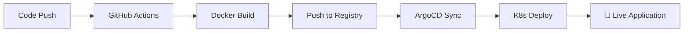

# CI/CD 파이프라인 빠른 시작 가이드

## 🎯 목표

GitHub Registry 연동과 ArgoCD 자동배포를 통한 완전한 GitOps 워크플로우 구축

## ⚡ 빠른 설정 (5분)

```bash
# 1. 모든 것을 자동으로 설정
./scripts/setup-complete-cicd.sh

# 2. 개별 설정 (선택사항)
./scripts/setup-github-secrets.sh     # GitHub Secrets만
./scripts/setup-argocd-app.sh         # ArgoCD Application만
```

## 📋 워크플로우



### 자세한 흐름:

1. **개발자**: 코드 변경 후 `git push`
2. **GitHub Actions**: 
   - 테스트 실행
   - Docker 이미지 빌드
   - `registry.jclee.me`에 푸시
   - `kustomization.yaml` 업데이트
3. **ArgoCD**: 
   - Git 변경사항 감지 (3분마다)
   - 새 이미지로 배포
   - 자동 동기화 및 치유
4. **Kubernetes**: 롤링 업데이트로 무중단 배포

## 🔧 주요 구성요소

### GitHub Actions Workflow
- **파일**: `.github/workflows/main-cicd.yml`
- **트리거**: `main`, `master`, `develop` 브랜치 푸시
- **단계**: Test → Build → Push → Deploy
- **결과**: Docker 이미지가 `registry.jclee.me/fortinet:SHA`로 푸시

### ArgoCD Application
- **이름**: `fortinet`
- **소스**: `https://github.com/JCLEE94/fortinet.git`
- **경로**: `k8s/manifests`
- **네임스페이스**: `fortinet`
- **동기화**: 자동 (prune + self-heal)

### Docker Registry
- **URL**: `registry.jclee.me`
- **이미지**: `registry.jclee.me/fortinet`
- **태그**: `latest`, `SHA`, `branch-SHA`

## 📊 모니터링 대시보드

### GitHub Actions
```bash
# 워크플로우 상태 확인
gh run list --limit 5

# 특정 워크플로우 로그
gh run view <run-id> --log
```

### ArgoCD Dashboard
- **URL**: https://argo.jclee.me
- **앱 이름**: `fortinet`
- **상태 확인**: Health, Sync Status

### Kubernetes
```bash
# Pod 상태
kubectl get pods -n fortinet

# 배포 상태
kubectl rollout status deployment/fortinet-app -n fortinet

# 로그 확인
kubectl logs -f deployment/fortinet-app -n fortinet
```

### 애플리케이션 헬스체크
```bash
# 헬스체크
curl https://fortinet.jclee.me/api/health

# 상세 상태
curl https://fortinet.jclee.me/api/status
```

## 🚨 문제 해결

### GitHub Actions 실패
```bash
# Secrets 확인
gh secret list

# 워크플로우 재실행
gh run rerun <run-id>

# Secrets 재설정
./scripts/setup-github-secrets.sh
```

### ArgoCD 동기화 실패
```bash
# 애플리케이션 상태 확인
argocd app get fortinet --grpc-web

# 수동 동기화
argocd app sync fortinet --prune

# 강제 동기화
argocd app sync fortinet --force --prune
```

### Docker 이미지 문제
```bash
# 레지스트리 로그인
docker login registry.jclee.me

# 이미지 확인
docker images | grep fortinet

# 수동 빌드 테스트
docker build -f Dockerfile.production -t test-fortinet .
```

### Kubernetes 배포 문제
```bash
# 네임스페이스 확인
kubectl get ns fortinet

# 리소스 상태
kubectl get all -n fortinet

# 이벤트 확인
kubectl get events -n fortinet --sort-by='.lastTimestamp'
```

## 🔧 설정 커스터마이징

### 다른 브랜치 추가
```yaml
# .github/workflows/main-cicd.yml
on:
  push:
    branches: [ main, master, develop, staging ]  # staging 추가
```

### 다른 레지스트리 사용
```bash
# GitHub Variables 업데이트
gh variable set DOCKER_REGISTRY --body "your-registry.com"
gh secret set REGISTRY_USERNAME --body "your-username"
gh secret set REGISTRY_PASSWORD --body "your-password"
```

### 다른 ArgoCD 서버
```bash
# Secrets 업데이트
gh secret set ARGOCD_SERVER --body "your-argocd.com"
gh secret set ARGOCD_AUTH_TOKEN --body "your-token"
```

## 📈 성능 최적화

### 빌드 캐시 활성화
```yaml
# .github/workflows/main-cicd.yml에 추가
- name: Set up Docker Buildx
  uses: docker/setup-buildx-action@v3

- name: Build and Push
  uses: docker/build-push-action@v5
  with:
    cache-from: type=gha
    cache-to: type=gha,mode=max
```

### ArgoCD 동기화 주기 단축
```yaml
# argocd-cm ConfigMap에 추가
data:
  timeout.reconciliation: 60s  # 기본 180s에서 60s로
```

### 병렬 배포 활성화
```yaml
# ArgoCD Application에 추가
spec:
  syncPolicy:
    syncOptions:
    - RespectIgnoreDifferences=true
    - ApplyOutOfSyncOnly=true
```

## 🔐 보안 고려사항

### Secrets 관리
- **GitHub Secrets**: 민감한 정보 (토큰, 비밀번호)
- **Repository Variables**: 일반 설정 (URL, 이름)
- **정기 토큰 갱신**: ArgoCD, Registry 토큰

### 네트워크 보안
```yaml
# NetworkPolicy 예시
apiVersion: networking.k8s.io/v1
kind: NetworkPolicy
metadata:
  name: fortinet-netpol
  namespace: fortinet
spec:
  podSelector:
    matchLabels:
      app: fortinet
  policyTypes:
  - Ingress
  - Egress
```

### 이미지 보안 스캔
```yaml
# GitHub Actions에 추가
- name: Run Trivy vulnerability scanner
  uses: aquasecurity/trivy-action@master
  with:
    image-ref: ${{ env.REGISTRY }}/${{ env.IMAGE_NAME }}:${{ github.sha }}
```

## 📚 추가 자료

- [ArgoCD 공식 문서](https://argo-cd.readthedocs.io/)
- [GitHub Actions 문서](https://docs.github.com/en/actions)
- [Kustomize 가이드](https://kustomize.io/)
- [GitOps 베스트 프랙티스](https://www.gitops.tech/)

## 🚀 다음 단계

1. **Multi-cluster 배포**: 여러 환경 관리
2. **Progressive Delivery**: Canary, Blue-Green 배포
3. **모니터링 강화**: Prometheus, Grafana 연동
4. **알림 설정**: Slack, Discord 통합
5. **보안 강화**: Policy as Code, OPA Gatekeeper

---

💡 **Tip**: 변경사항이 적용되지 않으면 ArgoCD UI에서 "Hard Refresh"를 시도해보세요!