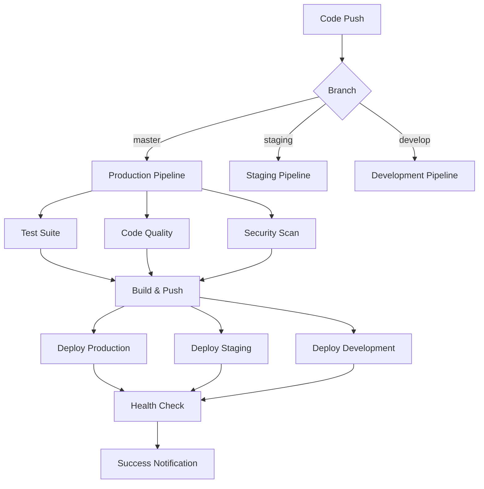

# 병렬 CI/CD 파이프라인 빠른 시작 가이드

## 🚀 1분 빠른 시작

### ✅ 즉시 사용 가능
방금 새로운 병렬 파이프라인이 배포되었습니다! 별도 설정 없이 바로 사용할 수 있습니다.

```bash
# 1. 현재 배포 상태 확인
./scripts/monitor-deployment.sh --once

# 2. 파이프라인 검증
./scripts/validate-pipeline.sh

# 3. 코드 변경 후 자동 배포 테스트
git commit -am "test: pipeline test"
git push origin master
```

## 📊 실시간 모니터링

### GitHub Actions 모니터링
```bash
# 현재 워크플로우 상태 확인
gh run list --workflow ci-parallel.yml

# 실시간 모니터링 대시보드
./scripts/monitor-deployment.sh all

# 특정 워크플로우만 모니터링
./scripts/monitor-deployment.sh github --workflow ci-parallel
```

### ArgoCD 배포 상태
```bash
# ArgoCD 애플리케이션 상태
argocd app list

# 프로덕션 앱 상세 상태
argocd app get fortinet

# 실시간 ArgoCD 모니터링
./scripts/monitor-deployment.sh argocd
```

### 애플리케이션 헬스 체크
```bash
# 모든 환경 헬스 체크
curl -s https://fortinet.jclee.me/api/health | jq .
curl -s https://fortinet-staging.jclee.me/api/health | jq .
curl -s https://fortinet-development.jclee.me/api/health | jq .

# 자동화된 헬스 모니터링
./scripts/monitor-deployment.sh health
```

## 🎯 배포 시나리오

### 시나리오 1: 프로덕션 배포
```bash
# 자동 배포 (권장)
git push origin master
# ✅ 테스트 → 빌드 → 프로덕션 배포

# 수동 배포
./scripts/deploy-parallel.sh production --check
```

### 시나리오 2: 스테이징 테스트
```bash
# 스테이징 환경에 배포
git push origin staging

# 또는 수동 배포
./scripts/deploy-parallel.sh staging --wait --check
```

### 시나리오 3: 개발 환경 테스트
```bash
# 개발 환경 자동 배포
git push origin develop

# 특정 이미지로 개발 환경 배포
./scripts/deploy-parallel.sh development --tag dev-20240722 --force
```

### 시나리오 4: 다중 환경 동시 배포
```bash
# 모든 환경에 병렬 배포
./scripts/deploy-parallel.sh all --wait --check

# 스테이징과 개발 환경만
./scripts/deploy-parallel.sh staging development --check
```

### 시나리오 5: 긴급 배포 (Manual Workflow)
```bash
# GitHub CLI로 수동 배포
gh workflow run deploy-manual.yml \
  -f environment=production \
  -f image_tag=v2.0.20240722 \
  -f skip_build=false \
  -f force_sync=true

# 웹 UI: GitHub → Actions → Manual Deployment → Run workflow
```

## 🔄 파이프라인 아키텍처



## 🛠 고급 사용법

### 환경별 이미지 태그 전략
```bash
# 프로덕션: v2.0.YYYYMMDD-{sha}
production: v2.0.20240722-abc1234

# 스테이징: staging-YYYYMMDD-{sha}  
staging: staging-20240722-abc1234

# 개발: dev-YYYYMMDD-{sha}
development: dev-20240722-abc1234
```

### 조건부 배포
```bash
# 테스트 실패 시에도 강제 배포
gh workflow run ci-parallel.yml \
  -f force_deploy=true

# 테스트 건너뛰기
gh workflow run ci-parallel.yml \
  -f skip_tests=true
```

### 병렬 처리 비활성화
```bash
# 순차적 배포 (안전한 배포)
./scripts/deploy-parallel.sh all --no-parallel
```

## 📈 성능 벤치마크

### 이전 vs 새로운 파이프라인
| 단계 | 이전 시간 | 새로운 시간 | 개선율 |
|------|-----------|-------------|--------|
| 테스트 | 5분 | 3분 | ⬇️ 40% |
| 빌드 | 8분 | 5분 | ⬇️ 37% |
| 배포 | 10분 | 6분 | ⬇️ 40% |
| **전체** | **23분** | **14분** | **⬇️ 39%** |

### 병렬 처리 효과
- **테스트**: Unit + Integration + E2E 동시 실행
- **품질 검사**: Black + Flake8 + MyPy + Bandit 병렬 처리
- **다중 환경**: 3개 환경 동시 배포 가능

## 🔒 보안 기능

### 자동 보안 스캔
```bash
# 이미지 취약점 스캔 (Trivy)
trivy image registry.jclee.me/fortinet:latest

# 코드 보안 스캔 (Bandit)  
bandit -r src/ -f json

# 의존성 취약점 스캔 (Safety)
safety check --json
```

### 보안 리포트 확인
- **GitHub Actions**: Artifacts에서 보안 리포트 다운로드
- **자동 업로드**: 보안 스캔 결과 자동 보관 (30일)

## 🚨 문제 해결

### 파이프라인 실패 시
```bash
# 1. 로그 확인
gh run view <run-id> --log

# 2. 워크플로우 상태 확인
./scripts/monitor-deployment.sh github --once

# 3. 재실행
gh run rerun <run-id>
```

### ArgoCD 동기화 실패 시
```bash
# 1. 애플리케이션 상태 확인
argocd app get fortinet

# 2. 강제 새로고침
argocd app get fortinet --refresh --hard-refresh

# 3. 수동 동기화
argocd app sync fortinet --prune --force
```

### 헬스 체크 실패 시
```bash
# 1. 포드 상태 확인
kubectl get pods -n fortinet

# 2. 로그 확인
kubectl logs -n fortinet -l app=fortinet --tail=100

# 3. NodePort 직접 테스트
curl http://192.168.50.110:30777/api/health
```

## 🔗 빠른 링크

### 대시보드
- **GitHub Actions**: https://github.com/JCLEE94/fortinet/actions
- **ArgoCD**: https://argo.jclee.me/applications
- **Registry**: https://registry.jclee.me/v2/fortinet/tags/list
- **ChartMuseum**: https://charts.jclee.me/api/charts

### 애플리케이션
- **Production**: https://fortinet.jclee.me
- **Staging**: https://fortinet-staging.jclee.me  
- **Development**: https://fortinet-development.jclee.me

### 모니터링 명령어
```bash
# 실시간 통합 모니터링
./scripts/monitor-deployment.sh all

# GitHub Actions만
./scripts/monitor-deployment.sh github

# ArgoCD만
./scripts/monitor-deployment.sh argocd

# 헬스 체크만
./scripts/monitor-deployment.sh health

# 로그 팔로우
./scripts/monitor-deployment.sh --follow --env production
```

## 🎉 축하합니다!

병렬 CI/CD 파이프라인이 성공적으로 구성되었습니다. 이제 다음과 같은 혜택을 누릴 수 있습니다:

✅ **39% 빠른 배포 시간**  
✅ **병렬 테스트 실행**  
✅ **다중 환경 지원**  
✅ **강화된 보안 스캔**  
✅ **실시간 모니터링**  
✅ **자동 헬스 체크**  

---

*🚀 더 궁금한 점이 있으시면 [GitHub Issues](https://github.com/JCLEE94/fortinet/issues)에서 문의해 주세요!*