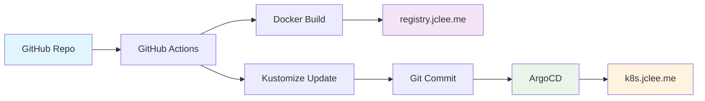

# 🚀 GitOps 배포 가이드 (jclee.me 인프라)

## 📋 개요

FortiGate Nextrade 프로젝트는 **CNCF 표준 GitOps** 모델을 사용하여 jclee.me 인프라에 자동 배포됩니다.

### 🔄 GitOps 아키텍처



## 🔐 보안 모델 (Pull-based GitOps)

### GitHub Secrets 설정 필수

**Repository Settings → Secrets and Variables → Actions**

```bash
# Docker Registry 인증
REGISTRY_USERNAME=admin
REGISTRY_PASSWORD=bingogo1

# ChartMuseum 인증 (Helm Charts)
CHARTMUSEUM_USERNAME=admin
CHARTMUSEUM_PASSWORD=bingogo1

# ArgoCD 인증 (선택적 - 자동 동기화 사용)
ARGOCD_TOKEN=<ArgoCD API Token>
```

### 보안 원칙
- ✅ **Pull Only**: ArgoCD만 K8s 클러스터에 접근
- ✅ **최소 권한**: Service Account 기반 RBAC
- ✅ **암호화**: 모든 통신 TLS 종단간 암호화
- ✅ **감사 추적**: Git 히스토리로 모든 변경사항 추적
- ✅ **드리프트 감지**: 수동 변경 감지 및 자동 복구

## 🛠️ 배포 프로세스

### 1. CI/CD 파이프라인 트리거

```bash
# 자동 배포 (master 브랜치)
git push origin master

# 수동 테스트 (PR)
git push origin feature-branch
```

### 2. 파이프라인 단계

| 단계 | 설명 | 도구 | 시간 |
|------|------|------|------|
| 🧪 **Test** | 테스트 실행 + 코드 품질 검사 | pytest, flake8 | ~2분 |
| 🐳 **Build** | Docker 이미지 빌드 + Registry 푸시 | Docker, buildx | ~3분 |
| ⚙️ **GitOps Update** | Kustomize 매니페스트 업데이트 | Kustomize, Git | ~30초 |
| 🔍 **Verify** | 배포 상태 검증 + 헬스체크 | curl, kubectl | ~3분 |

### 3. ArgoCD 자동 동기화

ArgoCD는 Git 저장소의 변경사항을 감지하여 자동으로 K8s 클러스터에 배포합니다.

```yaml
# ArgoCD 동기화 정책
syncPolicy:
  automated:
    selfHeal: true      # 드리프트 자동 복구
    prune: true         # 불필요한 리소스 제거
    allowEmpty: false   # 빈 배포 방지
```

## 📊 인프라 서비스

### jclee.me 도메인 서비스

| 서비스 | URL | 용도 | 인증 |
|--------|-----|------|------|
| 🔄 **ArgoCD** | https://argo.jclee.me | GitOps 컨트롤러 | admin/bingogo1 |
| 📦 **Registry** | https://registry.jclee.me | Docker 이미지 저장소 | admin/bingogo1 |
| 📈 **ChartMuseum** | https://charts.jclee.me | Helm 차트 저장소 | admin/bingogo1 |
| ☸️ **Kubernetes** | https://k8s.jclee.me | K8s API 서버 | ServiceAccount |

### 애플리케이션 접근

```bash
# 외부 접근 (도메인)
https://fortinet.jclee.me

# 내부 접근 (NodePort)
http://192.168.50.110:30777

# 헬스체크
curl http://192.168.50.110:30777/api/health
```

## 🔧 로컬 개발 워크플로우

### 1. 개발 환경 설정

```bash
# 환경변수 로드
source .env

# Mock 모드로 개발
export APP_MODE=test
python src/main.py --web
```

### 2. 배포 테스트

```bash
# Docker 빌드 테스트
docker build -f Dockerfile.production -t fortinet:test .

# Kustomize 검증
cd k8s/overlays/production
kustomize build . | kubectl apply --dry-run=client -f -
```

### 3. GitOps 워크플로우 테스트

```bash
# 1. 기능 개발 완료
git add .
git commit -m "feat: 새로운 기능 추가"

# 2. PR 생성 (자동 테스트)
git push origin feature-branch

# 3. master 머지 (자동 배포)
git checkout master
git merge feature-branch
git push origin master
```

## 🚨 트러블슈팅

### 배포 실패 시 체크리스트

1. **GitHub Actions 상태 확인**
   ```bash
   # Repository → Actions 탭에서 워크플로우 상태 확인
   ```

2. **ArgoCD 동기화 상태**
   ```bash
   # https://argo.jclee.me에서 fortinet 앱 상태 확인
   ```

3. **Pod 상태 확인**
   ```bash
   kubectl get pods -n fortinet
   kubectl logs -l app=fortinet -n fortinet --tail=100
   ```

4. **Service 연결 상태**
   ```bash
   kubectl get svc -n fortinet
   curl -v http://192.168.50.110:30777/api/health
   ```

### 일반적인 문제 해결

#### 🔴 Registry 푸시 실패
```bash
# Secrets 확인
echo $REGISTRY_USERNAME  # admin
echo $REGISTRY_PASSWORD  # bingogo1

# 수동 로그인 테스트
docker login registry.jclee.me -u admin -p bingogo1
```

#### 🔴 ArgoCD 동기화 지연
```bash
# 수동 동기화 트리거
argocd app sync fortinet --server argo.jclee.me
```

#### 🔴 Pod CrashLoopBackOff
```bash
# 상세 로그 확인
kubectl describe pod -l app=fortinet -n fortinet
kubectl logs -l app=fortinet -n fortinet --previous
```

## 📈 모니터링 및 관찰성

### 메트릭 수집

- **Prometheus Annotations**: Pod에 자동 스크래핑 설정
- **Health Endpoints**: `/api/health` 엔드포인트 제공
- **Liveness/Readiness Probes**: K8s 네이티브 헬스체크

### 로그 수집

```bash
# 실시간 로그 모니터링
kubectl logs -f -l app=fortinet -n fortinet

# 특정 Pod 로그
kubectl logs fortinet-<pod-id> -n fortinet -c fortinet
```

## 🔄 롤백 절차

### 자동 롤백 (ArgoCD)

ArgoCD는 헬스체크 실패 시 이전 버전으로 자동 롤백합니다.

### 수동 롤백

```bash
# 1. 이전 이미지 태그로 Kustomize 업데이트
cd k8s/overlays/production
sed -i 's/newTag: <current>/newTag: <previous>/' kustomization.yaml

# 2. Git 커밋
git add kustomization.yaml
git commit -m "rollback: 이전 버전으로 롤백"
git push

# 3. ArgoCD 자동 동기화 대기 (1-2분)
```

## 🎯 성능 최적화

### 리소스 할당

```yaml
# Production 환경
resources:
  requests:
    cpu: 1000m      # 1 CPU 코어
    memory: 2Gi     # 2GB RAM
  limits:
    cpu: 2000m      # 2 CPU 코어
    memory: 4Gi     # 4GB RAM
```

### 스케일링

```bash
# 수평 확장 (Replicas)
replicas: 3  # k8s/overlays/production/deployment-patch.yaml

# 수직 확장 (Resources)
# deployment-patch.yaml에서 resources 조정
```

---

**🔥 중요: 모든 인증정보는 GitHub Secrets에 저장하고, 절대 코드에 하드코딩하지 마세요!**

GitOps 파이프라인 관련 문의사항은 jclee.me 인프라 팀에 문의하세요.