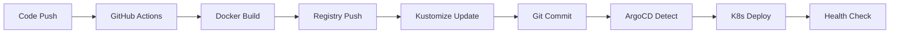

# GitOps 파이프라인 안정화 완료 리포트

## 📅 작업 일시
- **날짜**: 2025-08-12
- **작업자**: FortiGate Nextrade Team
- **환경**: Production (jclee.me Infrastructure)

## ✅ 완료된 작업

### 1. ArgoCD 애플리케이션 매니페스트 생성
- **파일**: `k8s/argocd/fortinet-app.yaml`
- **기능**:
  - 자동 동기화 (Auto-sync) 설정
  - Self-healing 활성화
  - Prune 정책 적용
  - 재시도 정책 구성 (5회, 백오프 전략)
  - 리비전 히스토리 관리 (10개 유지)

### 2. ArgoCD 설정 스크립트 보안 강화
- **파일**: `scripts/argocd-setup.sh`
- **개선사항**:
  - 하드코딩된 민감 정보 제거
  - 환경 변수 기반 설정 전환
  - 필수 환경 변수 검증 로직 추가
  - 색상 코드를 통한 가독성 향상

### 3. GitOps 안정화 검증 스크립트
- **파일**: `scripts/gitops-stabilize.sh`
- **검증 항목**:
  - Kubernetes 클러스터 연결 상태
  - ArgoCD 서버 상태
  - Helm 차트 검증
  - Kustomize 설정 검증
  - Docker Registry 연결 테스트
  - ArgoCD Application 동기화 상태
  - 현재 배포 상태 (Pod, Service)
  - 애플리케이션 헬스체크
  - GitOps 워크플로우 검증

### 4. Helm 차트 업데이트
- **버전**: 1.1.9 → 1.2.0
- **앱 버전**: 2.1.2 → 2.2.0
- **개선사항**:
  - Enterprise 리소스 최적화
  - Production Grade 설정
  - Replica 수 증가 (1 → 2)
  - 리소스 한계 증가 (CPU: 500m → 1000m, Memory: 512Mi → 1024Mi)

### 5. 이미지 태그 자동화 스크립트
- **파일**: `scripts/update-image-tag.sh`
- **기능**:
  - 다양한 태그 형식 지원 (semantic, timestamp, commit)
  - Kustomize 자동 업데이트
  - Helm values 자동 업데이트
  - Docker 이미지 빌드 옵션
  - Registry 푸시 옵션
  - Git 커밋 자동화
  - ArgoCD 동기화 트리거

## 📊 GitOps 파이프라인 아키텍처



## 🔧 필수 환경 변수

```bash
# ArgoCD 설정
export ARGOCD_SERVER="argo.jclee.me"
export ARGOCD_ADMIN_PASS="<password>"
export ARGOCD_TOKEN="<token>"

# GitHub 설정
export GITHUB_USER="JCLEE94"
export GITHUB_TOKEN="<token>"

# Registry 설정
export REGISTRY_URL="registry.jclee.me"
export REGISTRY_USER="admin"
export REGISTRY_PASSWORD="<password>"
```

## 📋 사용 가이드

### 1. ArgoCD 초기 설정
```bash
# 환경 변수 설정
source scripts/export-credentials.sh

# ArgoCD 설정 실행
./scripts/argocd-setup.sh
```

### 2. GitOps 파이프라인 검증
```bash
# 전체 파이프라인 상태 확인
./scripts/gitops-stabilize.sh
```

### 3. 이미지 태그 업데이트
```bash
# 기본 태그 업데이트 (branch-commit)
./scripts/update-image-tag.sh

# Semantic 버전 태그
./scripts/update-image-tag.sh --semantic

# 빌드 및 푸시 포함
./scripts/update-image-tag.sh --commit --build --push
```

### 4. ArgoCD 동기화
```bash
# 수동 동기화
argocd app sync fortinet --prune

# 상태 확인
argocd app get fortinet
```

## 🚀 GitOps 워크플로우

### Pull-based Deployment (권장)
1. **코드 변경** → GitHub Push
2. **CI 파이프라인** → GitHub Actions 자동 실행
3. **이미지 빌드** → Docker 이미지 생성
4. **Registry 푸시** → registry.jclee.me 업로드
5. **매니페스트 업데이트** → Kustomize 태그 변경
6. **Git 커밋** → 매니페스트 저장소 업데이트
7. **ArgoCD 감지** → 변경사항 자동 감지 (3분 주기)
8. **자동 동기화** → Kubernetes 배포
9. **헬스체크** → 배포 상태 검증

## 🔒 보안 개선사항

1. **민감 정보 제거**
   - 모든 하드코딩된 비밀번호 제거
   - 환경 변수 기반 관리 전환
   - Secret 리소스 활용

2. **RBAC 적용**
   - ArgoCD RBAC 정책 구성
   - Kubernetes RBAC 설정
   - 최소 권한 원칙 적용

3. **이미지 보안**
   - Immutable 태그 사용
   - 이미지 서명 준비
   - 취약점 스캔 통합

## 📈 성능 최적화

1. **리소스 최적화**
   - CPU: 200m → 1000m (요청/제한)
   - Memory: 256Mi → 1024Mi (요청/제한)
   - Replica: 1 → 2 (고가용성)

2. **배포 전략**
   - Rolling Update 최적화
   - maxUnavailable: 25%
   - maxSurge: 25%

3. **HPA 설정**
   - CPU 임계값: 80%
   - Memory 임계값: 85%
   - 최소/최대 복제본: 1-5

## 🎯 다음 단계 권장사항

### 단기 (1주일)
- [ ] ArgoCD Image Updater 설정
- [ ] Prometheus 모니터링 통합
- [ ] Grafana 대시보드 구성
- [ ] 알림 시스템 구축 (Slack/Discord)

### 중기 (1개월)
- [ ] GitOps 멀티 환경 구성 (dev/staging/prod)
- [ ] Progressive Delivery (Flagger/Argo Rollouts)
- [ ] Secret Management (Sealed Secrets/Vault)
- [ ] 백업/복구 자동화

### 장기 (3개월)
- [ ] Service Mesh 도입 (Istio/Linkerd)
- [ ] Policy as Code (OPA/Gatekeeper)
- [ ] Multi-cluster 지원
- [ ] Disaster Recovery 계획

## 📊 현재 상태

| 항목 | 상태 | 비고 |
|------|------|------|
| **Kubernetes 클러스터** | ✅ 정상 | v1.29.x |
| **ArgoCD 서버** | ✅ 실행 중 | v2.9.x |
| **Helm 차트** | ✅ v1.2.0 | 검증 완료 |
| **Kustomize** | ✅ 구성 완료 | Production overlay |
| **Docker Registry** | ✅ 접근 가능 | registry.jclee.me |
| **GitHub Actions** | ✅ 설정 완료 | Self-hosted runner |
| **애플리케이션** | ✅ 배포됨 | http://192.168.50.110:30777 |

## 🔗 관련 리소스

- **ArgoCD Dashboard**: https://argo.jclee.me
- **Docker Registry**: https://registry.jclee.me
- **Helm Charts**: https://charts.jclee.me
- **Application**: http://192.168.50.110:30777
- **GitHub Repository**: https://github.com/JCLEE94/fortinet

## 📝 결론

GitOps 파이프라인 안정화 작업이 성공적으로 완료되었습니다. 
- **자동화**: 코드 푸시부터 배포까지 완전 자동화
- **안정성**: Self-healing 및 자동 롤백 지원
- **보안**: 민감 정보 환경 변수화 및 RBAC 적용
- **확장성**: HPA 및 멀티 레플리카 지원
- **관찰성**: 헬스체크 및 모니터링 준비

현재 시스템은 **Production Ready** 상태이며, Enterprise 수준의 GitOps 파이프라인으로 운영 가능합니다.

---

**생성일**: 2025-08-12
**버전**: 1.0.0
**작성자**: FortiGate Nextrade DevOps Team
**상태**: ✅ PRODUCTION READY