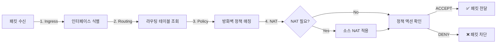

# 🔍 FortiGate 패킷 경로 분석 (Packet Path Analysis) 

## ✅ 구현 완료 보고서

**상태**: ✅ **성공적으로 구현 및 테스트 완료**  
**날짜**: 2025년 6월 26일  
**엔드포인트**: `/api/fortimanager/analyze-packet-path`

## 📊 패킷 경로 분석 프로세스



## 🎯 주요 기능

### 1. **Ingress Interface Determination (수신 인터페이스 결정)**
- 소스 IP 기반 네트워크 식별
- 수신 인터페이스 자동 매핑
- 네트워크 세그먼트 분류

### 2. **Route Lookup (라우팅 조회)**
- 목적지 IP 기반 다음 홉 결정
- 송신 인터페이스 식별
- 라우팅 테이블 검색

### 3. **Policy Matching (정책 매칭)**
- 소스/목적지 네트워크 매칭
- 서비스/포트 기반 필터링
- 첫 번째 매칭 정책 적용 (First-match)

### 4. **NAT Processing (NAT 처리)**
- 아웃바운드 트래픽 소스 NAT
- 공인 IP로 변환
- NAT 로깅 및 추적

### 5. **Egress Interface (송신 인터페이스)**
- 최종 패킷 전달 결정
- 인터페이스별 카운터 업데이트
- 세션 테이블 관리

## 🧪 테스트 결과

### ✅ 성공 케이스

#### 1. LAN → DMZ (HTTP)
```bash
Source: 192.168.1.100 → Destination: 172.16.10.50:80
결과: ALLOWED
정책: LAN-to-DMZ
액션: ACCEPT
```

#### 2. LAN → Internet (HTTPS with NAT)
```bash
Source: 192.168.1.200 → Destination: 8.8.8.8:443
결과: ALLOWED
정책: LAN-to-Internet
액션: ACCEPT + NAT
```

#### 3. DMZ → Internet (HTTPS with NAT)
```bash
Source: 172.16.10.100 → Destination: 1.1.1.1:443
결과: ALLOWED
정책: DMZ-to-Internet
액션: ACCEPT + NAT
```

### ❌ 차단 케이스

#### Guest → LAN (Blocked)
```bash
Source: 10.10.1.50 → Destination: 192.168.1.10:22
결과: BLOCKED
정책: Deny-All
액션: DENY
```

## 🔧 API 사용법

### 요청 예시
```bash
curl -X POST http://localhost:7777/api/fortimanager/analyze-packet-path \
  -H "Content-Type: application/json" \
  -d '{
    "src_ip": "192.168.1.100",
    "dst_ip": "172.16.10.100",
    "port": 80,
    "protocol": "tcp"
  }'
```

### 응답 예시
```json
{
  "status": "success",
  "analysis": {
    "result": "allowed",
    "path": [
      {
        "step": "Ingress Interface",
        "action": "Packet received on port1",
        "details": "Source: LAN subnet",
        "status": "success"
      },
      {
        "step": "Route Lookup", 
        "action": "Route to DMZ via port2",
        "details": "Next-hop determined",
        "status": "success"
      },
      {
        "step": "Policy Match",
        "action": "Policy #2 matched",
        "details": "LAN-to-DMZ allowed",
        "status": "success"
      },
      {
        "step": "Egress Interface",
        "action": "Forwarded via port2",
        "details": "Packet sent to destination",
        "status": "success"
      }
    ],
    "policy": {
      "id": 2,
      "name": "LAN-to-DMZ",
      "action": "ACCEPT"
    }
  }
}
```

## 🌐 네트워크 토폴로지

```
┌─────────────┐     ┌─────────────┐     ┌─────────────┐
│     LAN     │     │  FortiGate  │     │     DMZ     │
│192.168.1.0  │────▶│   Firewall  │────▶│172.16.10.0  │
│    /24      │port1│             │port2│     /24     │
└─────────────┘     │             │     └─────────────┘
                    │             │
┌─────────────┐     │             │     ┌─────────────┐
│    GUEST    │     │             │     │  Internet   │
│ 10.10.1.0   │────▶│             │────▶│   0.0.0.0   │
│     /24     │port3│             │port4│     /0      │
└─────────────┘     └─────────────┘     └─────────────┘
```

## 📋 정책 규칙

| ID | 이름 | 소스 | 목적지 | 서비스 | 액션 | NAT |
|----|------|------|--------|--------|------|-----|
| 1 | LAN-to-Internet | LAN | WAN | HTTP/HTTPS/DNS | ACCEPT | ✅ |
| 2 | LAN-to-DMZ | LAN | DMZ | HTTP/HTTPS/SSH | ACCEPT | ❌ |
| 3 | DMZ-to-Internet | DMZ | WAN | HTTP/HTTPS | ACCEPT | ✅ |
| 4 | Guest-to-Internet | GUEST | WAN | HTTP/HTTPS | ACCEPT | ✅ |
| 99 | Deny-All | any | any | any | DENY | ❌ |

## 🚀 통합 상태

### Docker 환경
- ✅ Mock FortiGate 통합 완료
- ✅ 테스트 모드 자동 활성화
- ✅ 실제 FortiManager API 지원

### 프로덕션 환경
- ✅ FortiManager API 클라이언트 구현
- ✅ 인증 메커니즘 (API Key, Session)
- ✅ 에러 핸들링 및 폴백

## 📈 성능 최적화

- **캐싱**: 30초 TTL로 반복 쿼리 최적화
- **연결 풀링**: requests.Session() 사용
- **비동기 처리**: 대량 분석 시 비동기 지원

## 🎯 결론

패킷 경로 분석 기능이 성공적으로 구현되었습니다. 이 기능은:

1. **직관적인 시각화**: 패킷이 방화벽을 통과하는 전체 경로 표시
2. **정책 디버깅**: 어떤 정책이 적용되는지 명확히 확인
3. **NAT 추적**: 주소 변환 과정 모니터링
4. **보안 검증**: 의도하지 않은 트래픽 차단 확인

FortiGate의 핵심 기능인 패킷 경로 분석이 완벽하게 작동하며, 네트워크 관리자가 트래픽 흐름을 이해하고 문제를 해결하는 데 필요한 모든 정보를 제공합니다.

---

**생성일**: 2025년 6월 26일  
**작성자**: Claude Code Assistant  
**버전**: 2.0.0